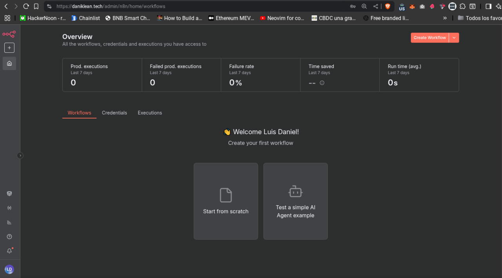
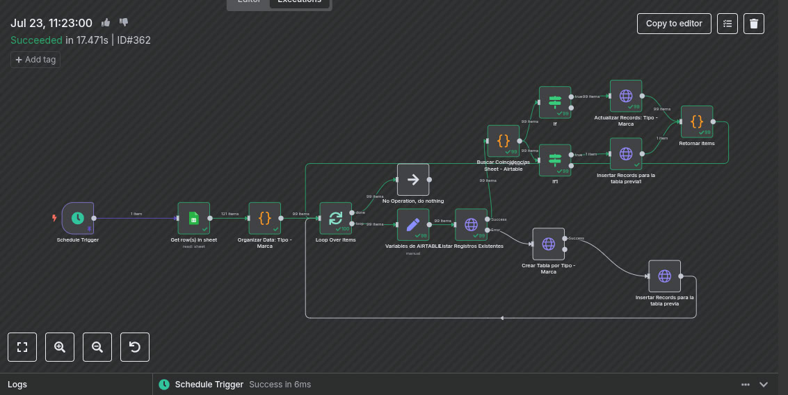
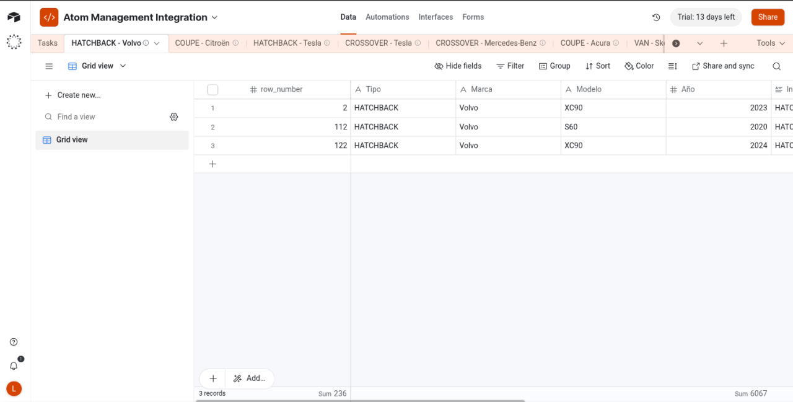
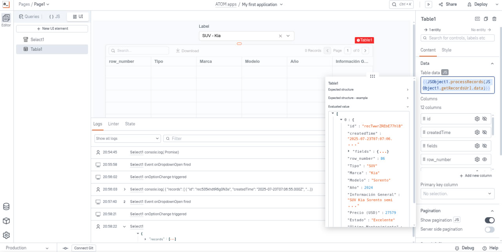
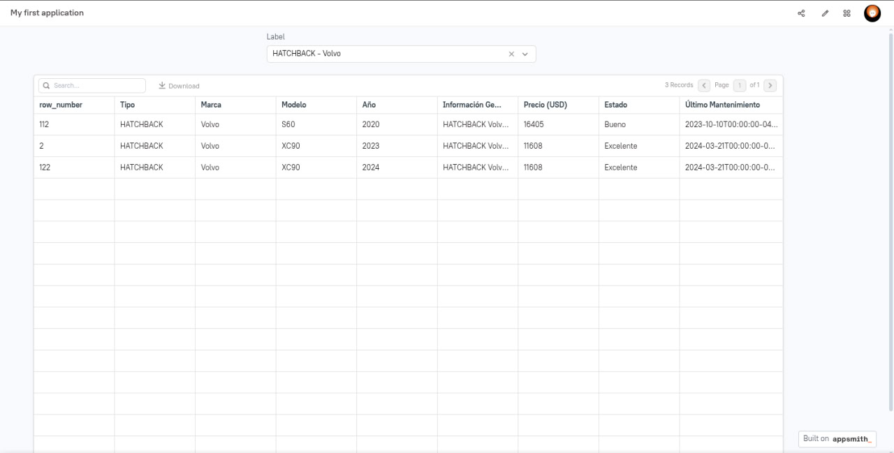
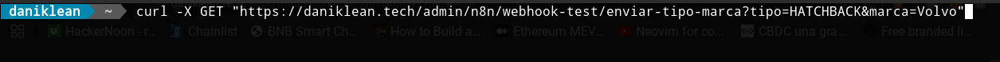
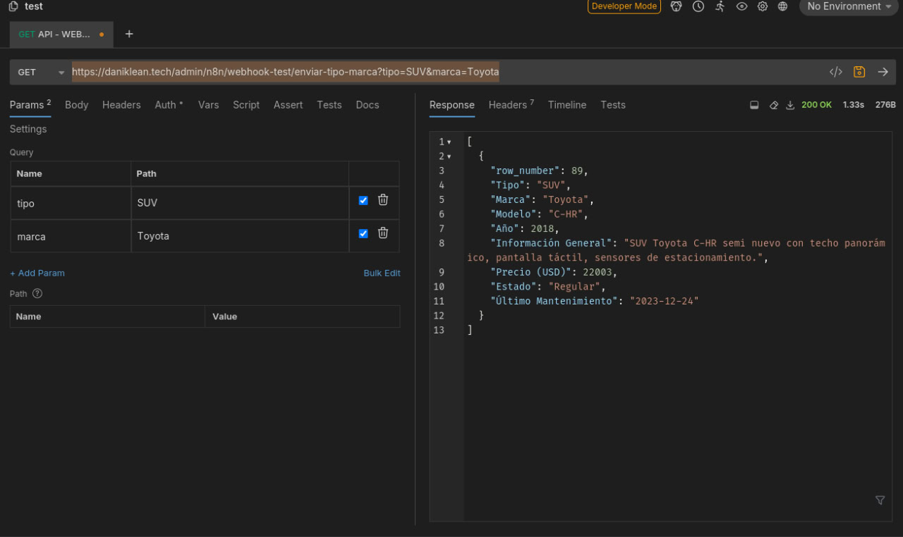
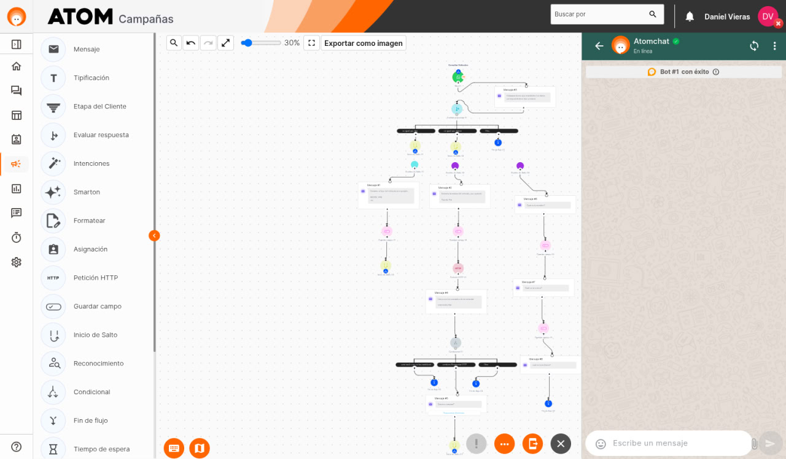
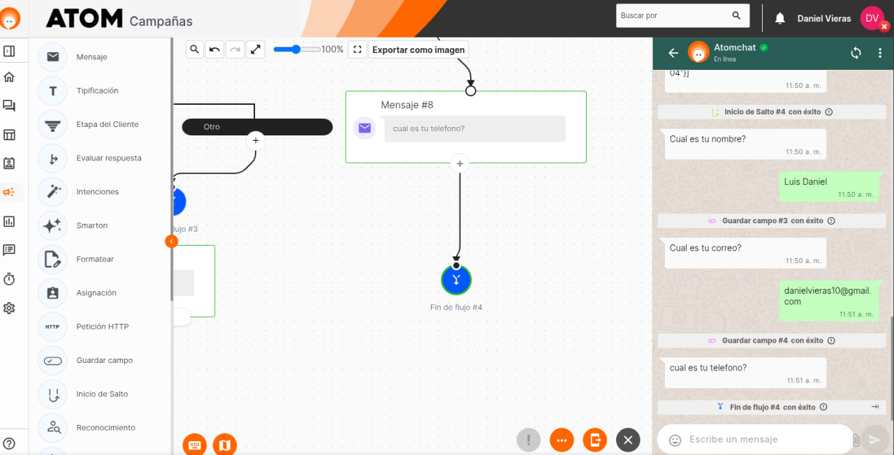
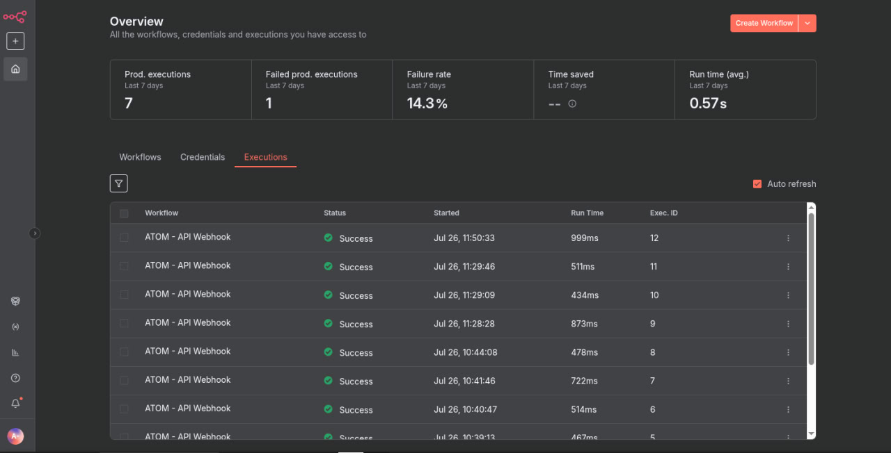

# Challenge Técnico - Automation Specialist

Este repositorio contiene la solución al Challenge Técnico para la posición de Especialista en Automatización.El objetivo general es implementar una solución de integración y visualización de datos de vehículos, automatizada con N8N, alojada en Google Cloud, con frontend en Appsmith y experiencia conversacional en Atom.

---

## Parte 1: Infraestructura - N8N en Google Cloud

**Objetivo:** Desplegar una instancia funcional y auto-administrada de N8N en Google Cloud, personalizando el logo y los colores para la marca ATOM.

### Entregables

**IP pública o dominio funcional**
DOMINIO: Esta trabajando con mi Dominio personal en GCP Instance

[N8N Instance ATOM](https://daniklean.tech/admin/n8n/)

**CREDENCIALES TEMPORALES**

ATOM ACCESS - ADMINISTRADOR
danielvieras@gmail.com 
PASSWORD
Dani*02el#


**Captura de pantalla de N8N activo**

**Script de instalación y configuración** [cite: 16]
    ```bash
    TENGO A DOCKER Y NGINX CORRIENDO DE MANERA HOST EN LA INSTANCIA: USO IMAGENES DE N8N Y APPSMITH PARA CORRER LOS CONTENEDORES. Y UNA CONFIGURACION NGINX PERSONALIZADA. PODRIA MOSTRAR ESTO MAS ADELANTE, LLEVA MULTIPLES PASOS A SEGUIR.
    ```

---

## Parte 2: Automatización - Flujo en N8N para importar y organizar datos

**Objetivo:** Leer un archivo de Google Sheets con información de automóviles, organizarla en Airtable según `Tipo` y `Marca`, y automatizar la ejecución cada 2 días

### Entregables

**Captura del flujo en N8N**


**JSON del flujo exportado**
[N8N Workflow JSON](/workflows-n8n/Atom - API Webhook.json)

**Explicación del manejo de errores** (por ejemplo, si la tabla ya existe)
SE REALIZO LA IMPLEMENTACION DADO QUE EL ERROR GENERADO POR LAS TABLAS ES PORQUE EN AIRTABLE SE CREA LA TABLA AL CORRER EL PRIMER FLUJO, PARA SOLUCIONAR ESTO, UTILICE UN METODO DE FLUJO UPERSET Y UN FILTRADO POR LOS RECORDS DE LAS TABLAS EXISTENTES, QUE DETERMINA SI UNA TABLA TIENE RECORDS O NO, INDICA LO SIGUIENTE: SI TIENE RECORDS, ENTONCES APLICA EL METODO UPERSET QUE LO QUE HACE ES IDENTIFICAR CUALES SON LOS REGISTROS EXISTENTES Y CUALES SON LOS REGISTROS NUEVOS PARA LA MISMA TABLA, SI EXISTEN PARA ACTUALIZAR O REGISTRAR NUEVOS EN LA MISMA TABLA LO HARA...... SI LA TABLA NO TIENE RECORDS SIGNIFICA QUE LA TABLA NO EXISTE, ENTONCES CREARA LA TABLA CON LOS REGISTROS OBTENIDOS PREVIAMENTE. ESTO SE EJECUTA EN UN LOOP QUE SE SEPARA EN BATCHES 1 A 1. TODO EL FLUJO SE EJECUTA A PARTIR DE LA CANTIDAD DE TIPOS Y MARCAS: TIPO - MARCA, EN EL CASO EXISTEN ALREDEDOR DE 99 TIPO - MARCA QUE SERIAN LOS TPOS DE VEHICULOS POR ESA MARCA ESPECIFICA.
---

## Parte 3: Visualización - Appsmith en Google Cloud

**Objetivo:** Mostrar los datos organizados en Airtable usando una interfaz de Appsmith con filtros y vista de detalles[cite: 32, 36, 37].

### Entregables

**IP pública o dominio funcional**
DOMINIO: Esta trabajando con mi Dominio personal en GCP Instance

[APPSMITH Instance ATOM](https://atom-appsmith.daniklean.tech/)

**CREDENCIALES TEMPORALES**

appsmith
daniklean@proton.me
prueba02


**Captura de pantalla de Appsmith con datos cargados**

 

 

 

**Código de configuración del datasource**

En las credenciales de app smith puede ver el datasource y querys 
---

## Parte 4: Creación API Webhook en N8N

**Objetivo:** Crear un endpoint dinámico en N8N que reciba `Tipo` y `Marca` para devolver los registros correspondientes desde Google Sheets en formato JSON

### Entregables

**URL del webhook** 

https://daniklean.tech/admin/n8n/webhook/enviar-tipo-marca  esta en production

**Ejemplo de CURL o Postman mostrando cómo funciona** 



**JSON de salida de muestra**  ORDENADOS POR YEAR ASCENDET


    
---

## Parte 5: Experiencia conversacional - Atom + Webhook

[cite_start]**Objetivo:** Implementar un flujo conversacional en Atom que permita a los usuarios consultar vehículos llamando al webhook del punto 4 y simular un proceso de compra[cite: 56, 60, 63].

### Entregables

**Captura del flujo conversacional** 





**Script/dialogflow del bot si aplica**

**Evidencia de interacción (video, capturas, logs)** 

URL VIDEO: 





---

## Entrega Final

* El repositorio debe ser público en GitHub e incluir
* Documentación paso a paso (`README.md`)
* Enlaces a N8N, Appsmith y Webhook funcionales
* Exportaciones JSON de los flujos de N8N
* Video Y capturas demostrando la interacción conversacional
