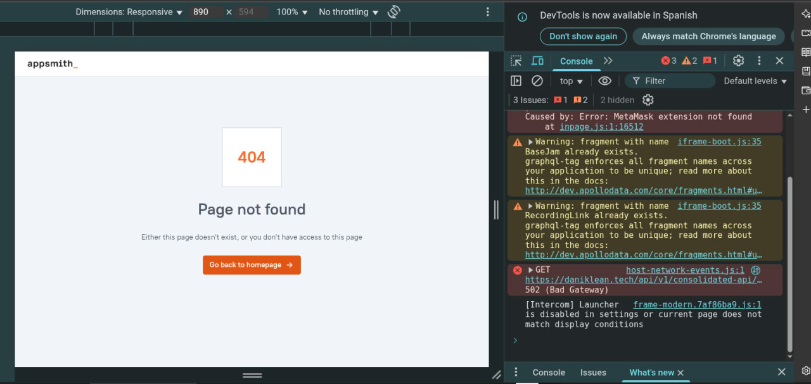
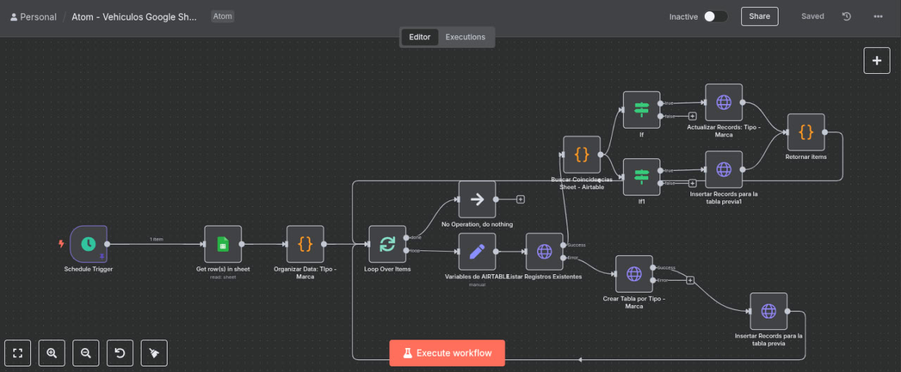

# Challenge Técnico - Automation Specialist

Este repositorio contiene la solución al Challenge Técnico para la posición de Especialista en Automatización. [cite_start]El objetivo general es implementar una solución de integración y visualización de datos de vehículos, automatizada con N8N, alojada en Google Cloud, con frontend en Appsmith y experiencia conversacional en Atom[cite: 3].

---

## Parte 1: Infraestructura - N8N en Google Cloud

[cite_start]**Objetivo:** Desplegar una instancia funcional y auto-administrada de N8N en Google Cloud, personalizando el logo y los colores para la marca ATOM[cite: 6, 10].

### Entregables

* [cite_start]**IP pública o dominio funcional** [cite: 14]
* [cite_start]**Captura de pantalla de N8N activo** [cite: 15]
    
* [cite_start]**Script de instalación y configuración** [cite: 16]
    ```bash
    # Pega aquí tu script de despliegue (Docker o instalación manual)
    ```

---

## Parte 2: Automatización - Flujo en N8N para importar y organizar datos

[cite_start]**Objetivo:** Leer un archivo de Google Sheets con información de automóviles, organizarla en Airtable según `Tipo` y `Marca`, y automatizar la ejecución cada 2 días[cite: 19, 25].

### Entregables

* [cite_start]**Captura del flujo en N8N** [cite: 27]
    
* [cite_start]**JSON del flujo exportado** [cite: 28]
* [cite_start]**Explicación del manejo de errores** (por ejemplo, si la tabla ya existe) [cite: 29]

---

## Parte 3: Visualización - Appsmith en Google Cloud

[cite_start]**Objetivo:** Mostrar los datos organizados en Airtable usando una interfaz de Appsmith con filtros y vista de detalles[cite: 32, 36, 37].

### Entregables

* [cite_start]**URL pública del frontend** [cite: 40]
* [cite_start]**Captura de pantalla de Appsmith con datos cargados** [cite: 41]
    
* [cite_start]**Código de configuración del datasource** [cite: 42]

---

## Parte 4: Creación API Webhook en N8N

[cite_start]**Objetivo:** Crear un endpoint dinámico en N8N que reciba `Tipo` y `Marca` para devolver los registros correspondientes desde Google Sheets en formato JSON[cite: 45, 47, 48, 49].

### Entregables

* [cite_start]**URL del webhook** [cite: 51]
* [cite_start]**Ejemplo de CURL o Postman mostrando cómo funciona** [cite: 52]
    
* [cite_start]**JSON de salida de muestra** [cite: 53]

---

## Parte 5: Experiencia conversacional - Atom + Webhook

[cite_start]**Objetivo:** Implementar un flujo conversacional en Atom que permita a los usuarios consultar vehículos llamando al webhook del punto 4 y simular un proceso de compra[cite: 56, 60, 63].

### Entregables

* [cite_start]**Captura del flujo conversacional** [cite: 71]
    
* [cite_start]**Script/dialogflow del bot si aplica** [cite: 72]
* [cite_start]**Evidencia de interacción (video, capturas, logs)** [cite: 73]
    

---

## Entrega Final

[cite_start]El repositorio debe ser público en GitHub e incluir[cite: 76]:
* [cite_start]Documentación paso a paso (`README.md`)[cite: 77].
* [cite_start]Enlaces a N8N, Appsmith y Webhook funcionales[cite: 78].
* [cite_start]Exportaciones JSON de los flujos de N8N[cite: 79].
* [cite_start]Video o capturas demostrando la interacción conversacional[cite: 80].
