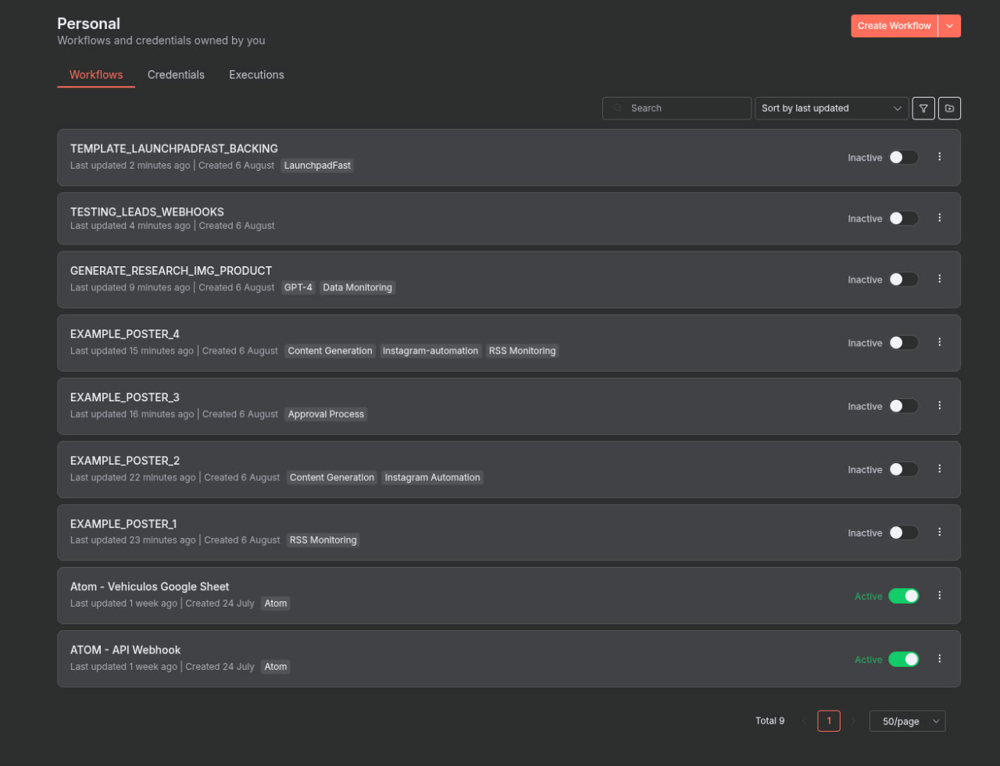
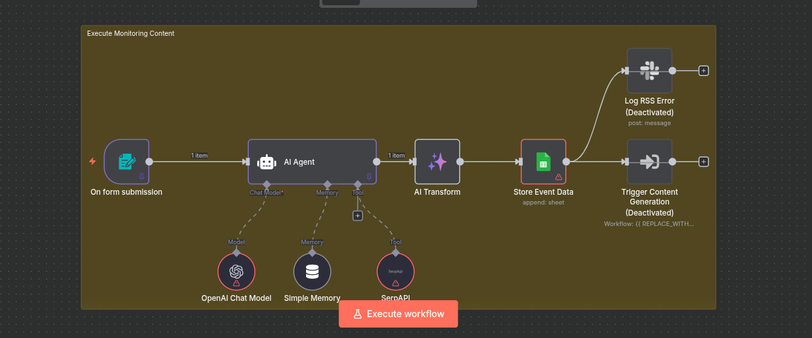
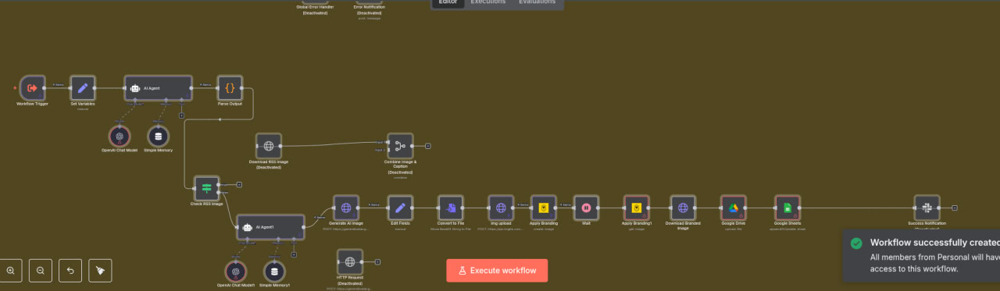
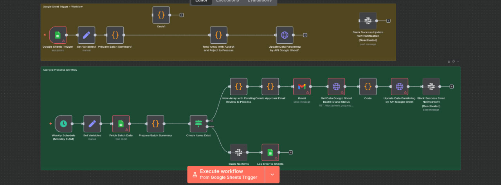
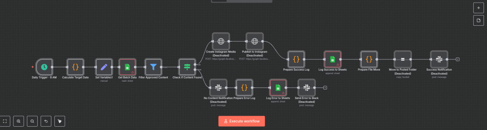
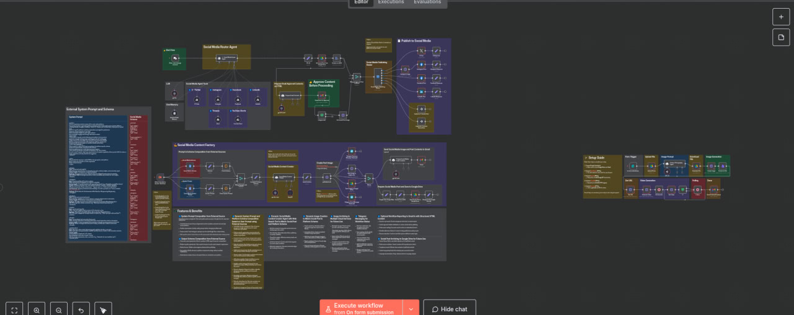
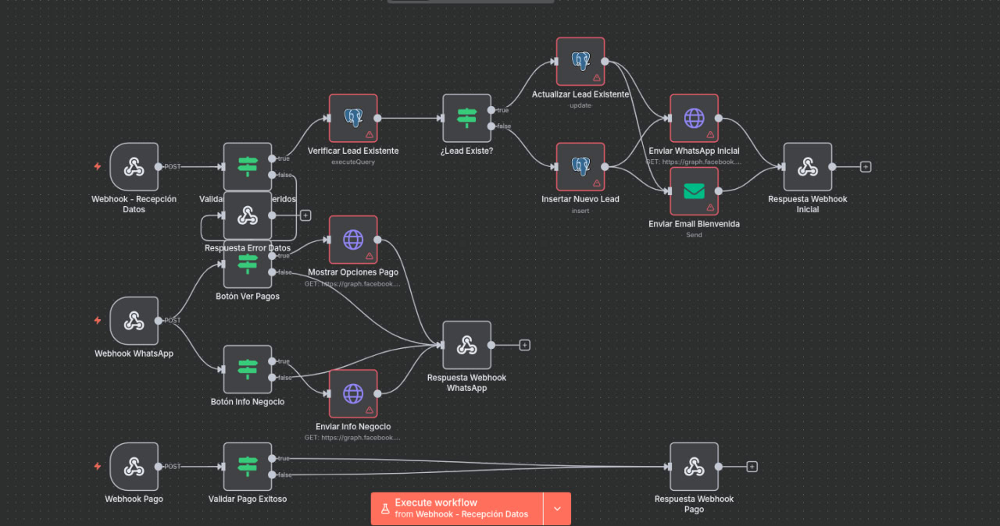
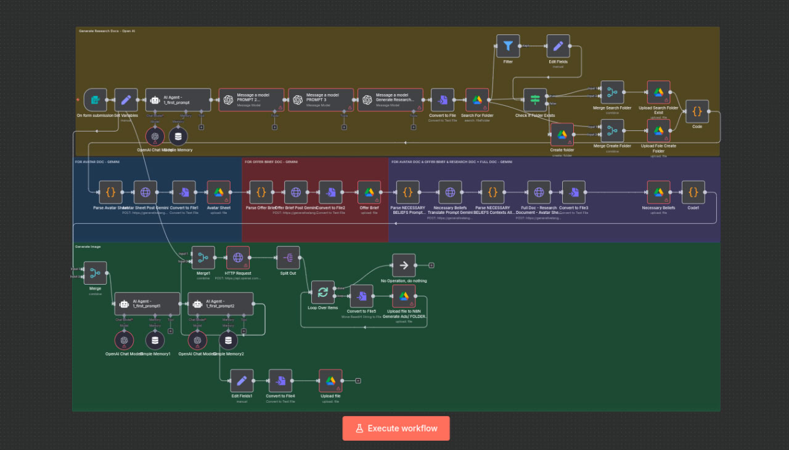

# 📘 n8n Workflows: Workflows Jobs

Este documento describe siete flujos de trabajo creados en n8n para automatizar la recolección, procesamiento, revisión y publicación de contenido de eventos y productos, optimizado para redes sociales.
---
Acceda a la direccion URL previa de N8N que monte en Google Cloud COMPUTE, inicie sesion con las credenciales previas documentadas en el primer readme fuera de esta carpeta y puede ver los workflows importados de mis anteriores implementaciones.

## 📂 auto\_IG\_generator\_poster\_#1

### 🎯 Propósito

Recolectar eventos relevantes con base en datos ingresados por el usuario, enriquecerlos usando AI, y almacenarlos en Google Sheets.

### 🔄 Flujo General

1. **Form Submission (********`On form submission`********)**

   - Inicia el flujo cuando un usuario completa un formulario con datos como ciudad, país, rango de fechas e intereses.

2. **LangChain AI Agent (********`AI Agent`********)**

   - Genera eventos relevantes usando herramientas como:
     - `SerpAPI` para búsquedas web
     - `OpenAI Chat Model` para análisis
     - `Simple Memory` para mantener contexto
   - Usa un prompt predefinido con formato Markdown para generar descripciones atractivas de eventos.

3. **AI Transform (********`AI Transform`********)**

   - Parsea el JSON generado por el agente AI y lo transforma a un formato legible para Google Sheets.

4. **Store Event Data (********`Google Sheets`********)**

   - Guarda los eventos en un Google Sheet llamado "event database".

5. **Opcionales (Deshabilitados)**

   - `Trigger Content Generation`: lanza otro flujo para generar contenido con base en eventos guardados.
   - `Log RSS Error`: notifica errores a Slack si ocurre alguna falla en la lectura de feeds RSS.

---

## 📂 auto\_IG\_generator\_poster\_#2

### 🎯 Propósito

Generar contenido visual y textual para Instagram Stories usando IA, aplicar branding personalizado, y almacenar los resultados en Google Drive y Google Sheets.

### 🔄 Flujo General

1. **Workflow Trigger (********`Workflow Trigger`********)**

   - Inicia el flujo manualmente o desde otro flujo de automatización.

2. **Set Variables (********`Set Variables`********)**

   - Define variables necesarias como plantillas, IDs y URLs.

3. **AI Agent (********`AI Agent`********)**

   - Genera contenido textual:
     - `Instagram Story Caption`
     - `10-word Text Overlay`

4. **Generar Imagen AI (********`AI Agent1`******** + ****************************`Generate AI Image`****************************)**

   - Crea una imagen relacionada con el evento usando IA generativa.

5. **Subir imagen (********`img upload`********)**

   - Sube la imagen generada a ImgBB y obtiene URLs públicas.

6. **Aplicar Branding (********`Apply Branding`********)**

   - Usa la API de Bannerbear para aplicar el texto overlay y ajustar branding visual según plantilla.

7. **Convertir y Guardar (********`Convert to File`********, ****************************`Download Branded Image`****************************)**

   - Convierte la imagen final en archivo descargable.

8. **Guardar en Drive y Sheets (********`Google Drive`********, ****************************`Google Sheets`****************************)**

   - Almacena imagen final en Google Drive.
   - Registra datos de publicación en Google Sheets.

9. **Notificaciones (********`Success Notification`********, ****************************`Error Notification`****************************)**

   - Notifica el resultado del proceso por Slack o correo si ocurre error.

---

## 📂 auto\_IG\_generator\_poster\_#3

### 🎯 Propósito

Gestión semanal del contenido aprobado para publicación en Instagram, incluyendo la validación, generación de correos, logs, y cambios de estado.

### 🔄 Flujo General

1. **Schedule Trigger (********`Weekly Schedule`********)**

   - Se activa todos los lunes a las 9:00 AM para procesar contenido pendiente.

2. **Set Variables (********`Set Variables`********)**

   - Define variables globales como `sheetId`, destinatario de correos y URLs.

3. **Fetch Batch Data (********`Google Sheets`********)**

   - Obtiene los datos de contenido desde Google Sheets (historial de contenido de IG).

4. **Prepare Batch Summary (********`Prepare Batch Summary`********)**

   - Genera el resumen de la semana con un batch ID único, total de ítems y fecha límite para revisión.

5. **Check Items Exist (********`IF`********)**

   - Verifica si hay ítems con estado "Pending Review".
     - ✅ Sí: continúa con envío de correo.
     - ❌ No: envía notificación por Slack y guarda error en Google Sheets.

6. **Filter Items (********`New Array with Pending Review to Process`********)**

   - Filtra los eventos para incluir solo los que necesitan revisión.

7. **Generate Email HTML (********`Create Approval Email`********)**

   - Crea el correo HTML con botones para:
     - Revisar el documento de Google Sheets
     - Aprobar o rechazar vía formulario de Google

8. **Send Email (********`Gmail`********)**

   - Envía el correo de revisión al responsable.

9. **Get and Update Data in Sheets**

   - Consulta Google Sheets para ver los estados de Batch y aplica las actualizaciones necesarias:
     - Inserta `Batch ID` en celdas vacías
     - Cambia estado a `Tracking` si aplica

10. **Actualizar por Aprobación Humana**

    - Si un humano cambia manualmente el estado a `Accept` o `Reject`:
      - Se detecta el cambio y se actualizan todas las filas del batch con `Accept Status` o `Reject Status`.

### 🛠️ Otros componentes

- `Slack`: Se usa para notificaciones tanto en casos de éxito como error.
- `Sticky Notes`: Utilizadas como anotaciones visuales en el canvas para describir el flujo.

---

## 📂 auto\_IG\_generator\_poster\_#4

### 🎯 Propósito

Publicar automáticamente historias de Instagram 3 días antes del evento programado, utilizando contenido previamente aprobado en Google Sheets.

### 🔄 Flujo General

1. **Daily Trigger (********`8 AM`********)**

   - Ejecuta el flujo diariamente a las 8:00 AM.

2. **Calculate Target Date**

   - Calcula la fecha objetivo (hoy + 3 días) para buscar eventos que se publicarán.

3. **Set Variables**

   - Establece valores como `sheetId`, canal de Slack, email, etc.

4. **Get Batch Data (********`Google Sheets`********)**

   - Obtiene eventos desde Google Sheets para revisión y filtrado.

5. **Filter Approved Content**

   - Filtra eventos que tienen el estado `Accept Status` y coinciden con el `Batch ID`.

6. **Check if Content Found**

   - Verifica si se encontró contenido válido.
     - ✅ Sí: continúa a publicación en Instagram.
     - ❌ No: envía notificación de que no hay contenido para publicar.

7. **Create Instagram Media / Publish to Instagram**

   - Crea y publica contenido como `Story` vía Facebook Graph API (deshabilitado por defecto).

8. **Prepare Success Log**

   - Estructura un log para indicar publicación exitosa.

9. **Log Success to Sheets**

   - Guarda el log en una hoja de Google Sheets para trazabilidad.

10. **Prepare File Move / Move to Posted Folder**

- Prepara y ejecuta el movimiento del archivo publicado a carpeta permanente (deshabilitado).

11. **Prepare Error Log / Log Error to Sheets / Notify Slack**

- Si ocurre error, registra en Sheets y notifica por Slack (deshabilitados).

12. **Slack Notification (deshabilitados)**

- Notificaciones para éxito, error, o ausencia de contenido se pueden activar si se desea seguimiento.

---

## 📂 Workflow Bank (Testing)

### 🎯 FLUJO PRINCIPAL 1: Go 2 Market - Generación Automática de Materiales de Marketing

#### Descripción General

Este flujo automatiza la creación de materiales de marketing profesionales a partir de una foto de producto, generando tanto imágenes mejoradas como videos promocionales.

#### Componentes del Flujo:

1. **Trigger - Formulario Web**

   - Captura datos del usuario mediante un formulario web

2. **Gestión de Archivos en Google Drive**

   - Subida, descarga y organización de imagenes en carpeta "Product Creatives"

3. **Generación de Prompt para Fotografía de Producto**

   - Utiliza GPT 4.1 via OpenRouter para construir un prompt con base en el producto

4. **Edición de Imagen con OpenAI**

   - Aplica mejoras visuales profesionales usando edición IA

5. **Generación de Video con Runway ML**

   - Crea un video rotacional del producto de 10 segundos vía ImgBB y Runway ML

6. **Sistema de Polling y Entrega**

   - Verifica estado del video generado y lo entrega por Gmail

---

### 🚀 FLUJO PRINCIPAL 2: Social Media Content Factory

#### Descripción General

Sistema completo para generar, aprobar y publicar contenido optimizado para múltiples plataformas de redes sociales usando IA.

#### Componentes del Flujo:

1. **Triggers Duales** (Chat o Workflow manual)

2. **Gestión Externa de Prompts y Esquemas**

   - Prompts en Google Docs y esquemas JSON por plataforma

3. **Motor de IA para Contenido**

   - GPT-4o-mini + SerpAPI para generación de contenido por plataforma

4. **Generación de Imágenes**

   - IA generativa via pollinations.ai

5. **Aprobación por Email**

   - Gmail con HTML y timeout de 45 minutos para aceptar/rechazar

6. **Router de Publicación**

   - Publica en Instagram, Facebook, Twitter, LinkedIn (Threads y Shorts próximamente)

7. **Herramientas IA por Plataforma**

8. **Archivado y Notificaciones**

   - Google Drive, Gmail y Telegram

---

## Webhooks de Validacion de informacion

## ASAP_FIRTS_WORKFLOW_1: Buscador de Informacion de productos, generador de informacion de mercado, genera informes de avatar briefs de posibles ventas, genera imagenes de produtos con GPT_IMAGE_1 saca 3 variaciones del mismo, y sube todos los documentos a Google Drive (FUTURA IMPLEMENTACION PARA BOT DE TELEGRAM, NO CULMINADA EN ESTE CONTRATO).

## 🧩 Requisitos Técnicos

- Google Workspace (Drive, Gmail)
- OpenRouter (GPT-4.1), OpenAI (Imagen)
- ImgBB, Runway ML, SerpAPI
- Facebook Graph, Twitter, LinkedIn APIs
- Telegram

---

## ✅ Beneficios del Sistema

- Automatización completa de marketing y redes sociales
- Calidad profesional, menor tiempo y mayor escalabilidad
- Sistema robusto, modular, mantenible y extensible

📩 **Contacto interno para soporte**: *[ Luis Daniel Vieras Montilla: @daniklean email: danielvieras10@gmail.com / daniklean@proton.me ]*

